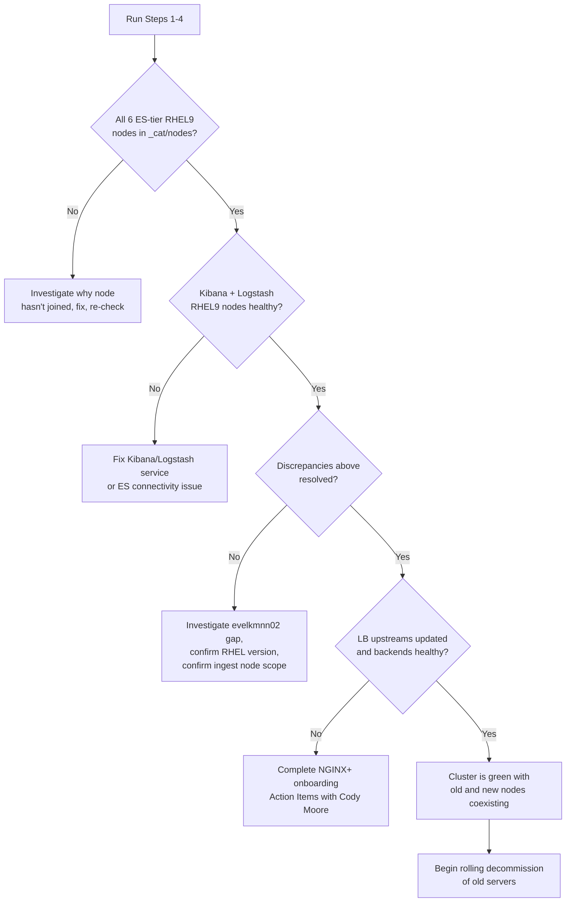

# RHEL9 ELK Test Cluster Migration — Validation Guide

2026-09-17

## Bottom line

All 6 required Elasticsearch-tier RHEL9 servers (3 masters + 3 data nodes) have joined the TEST cluster and are visible in `_cat/nodes`. Kibana and Logstash RHEL9 servers can't be confirmed that way and need the separate checks in Step 3. One old RHEL8 master (`evelkmnn02`) is unexpectedly missing from the cluster entirely, and a possible second RHEL9 ingest node (`evelkinn02`) mentioned in only one source document hasn't joined either — both need investigation before any decommissioning starts.

| Area | Status |
| --- | --- |
| RHEL9 ES masters (mnn04-06) | Joined - confirmed in \_cat/nodes |
| RHEL9 ES data nodes (wkn04-06) | Joined - confirmed in \_cat/nodes |
| RHEL9 Kibana (ftn01-02) | Not verifiable via \_cat/nodes - see Step 3 |
| RHEL9 Logstash (lsn01-02) | Not verifiable via \_cat/nodes - see Step 3 |
| Old master evelkmnn02 | Missing from cluster - unexplained |
| RHEL9 evelkinn02 (if required) | Not seen anywhere - open question |
| Load balancer onboarding | Not yet validated - see Step 4 |

This doc walks through validating each piece, then lays out the decommission path once RHEL9 is confirmed stable.

## Required RHEL9 servers (per the "ELK Test Cluster VMs" doc)

| Hostname | Role | CPU | Memory (GB) | Storage | Joins ES cluster? |
| --- | --- | --- | --- | --- | --- |
| evelkmnn04 | Master 01 | - | - | - | Yes |
| evelkmnn05 | Master 02 | - | - | - | Yes |
| evelkmnn06 | Master 03 | - | - | - | Yes |
| evelkwkn04 | Elasticsearch | 6 | 31 | 3.2TB | Yes |
| evelkwkn05 | Elasticsearch | 6 | 31 | 3.2TB | Yes |
| evelkwkn06 | Elasticsearch | 6 | 31 | 3.2TB | Yes |
| evelklsn01 | Logstash | 4 | 15 | 3TB | No |
| evelklsn02 | Logstash | 4 | 15 | 3TB | No |
| evelkftn01 | Kibana | 4 | 15 | 275GB | No |
| evelkftn02 | Kibana | 4 | 15 | 275GB | No |

10 servers total: 6 join the Elasticsearch cluster directly (validate with `_cat/nodes` in Step 2), 4 (Kibana + Logstash) don't join the ES cluster and need the separate checks in Step 3.

One open question: the "RHEL9 Upgrade - Complete Guide" doc also references a new ingest node `evelkinn02.corp.fin` that doesn't appear in this table - flagged under Discrepancies below.

## Step 1 - Validate VM provisioning

For each of the 10 servers above, confirm before checking cluster membership:

1. **VM exists and is reachable** - `ssh <hostname>.corp.fin` succeeds. Check DNS/Infoblox registration explicitly for `evelklsn01/02` and `evelkftn01/02` - the source doc's own Action Items flag this as still pending.
2. **OS version** - `cat /etc/redhat-release` confirms RHEL 9.x, not 7.x or 8.x.
3. **Sizing matches the allocation table** - `nproc` for CPU, `free -g` for memory, `df -h` for storage.
4. **Hostname and network** - `hostname -f` returns the expected FQDN; IP matches DNS/Infoblox and the NGINX+ upstream config.
5. **Elastic Stack version installed** - `rpm -qa | grep -E 'elasticsearch|kibana|logstash'` matches the target version (8.18.1 per the upgrade guide).

Track results here:

| Hostname | VM up | RHEL9 confirmed | Sizing OK | DNS registered | Stack version OK |
| --- | --- | --- | --- | --- | --- |
| evelkmnn04 |  |  |  |  |  |
| evelkmnn05 |  |  |  |  |  |
| evelkmnn06 |  |  |  |  |  |
| evelkwkn04 |  |  |  |  |  |
| evelkwkn05 |  |  |  |  |  |
| evelkwkn06 |  |  |  |  |  |
| evelklsn01 |  |  |  |  |  |
| evelklsn02 |  |  |  |  |  |
| evelkftn01 |  |  |  |  |  |
| evelkftn02 |  |  |  |  |  |

## Step 2 - Validate Elasticsearch cluster membership

Run `GET _cat/nodes?v` against the test cluster. Based on the `get_cat_nodes.txt` output already captured:

| Hostname | Roles | Master-eligible | Generation | Status |
| --- | --- | --- | --- | --- |
| evelkmnn06 | m | Yes - elected master (\*) | RHEL9 | Joined |
| evelkmnn04 | lm | Yes | RHEL9 | Joined |
| evelkmnn05 | m | Yes | RHEL9 | Joined |
| evelkmnn01 | m | Yes | Old | Still in cluster |
| evelkmnn03 | m | Yes | Old | Still in cluster |
| evelkmnn02 | - | - | Old | Not present in the cluster at all |
| evelkwkn04 | cfhilrstw | No | RHEL9 | Joined |
| evelkwkn02 | cfhlrstw | No | Old | Still in cluster |
| evelkwkn05 | cfhlrstw | No | RHEL9 | Joined |
| evelkwkn01 | chlrstw | No | Old | Still in cluster |
| evelkwkn03 | f | No | Old | Still in cluster |
| evelkwkn06 | f | No | RHEL9 | Joined |
| evelkinn01 | i | No | Old | Still in cluster |

**Findings:**

- All 6 required Elasticsearch-tier RHEL9 nodes (`evelkmnn04/05/06`, `evelkwkn04/05/06`) have joined the cluster. `evelkmnn06` is currently the elected master.
- Old and new worker roles line up cleanly in pairs by role string (`evelkwkn01<->04` full data set + ingest, `evelkwkn02<->05` matching data tiers, `evelkwkn03<->06` frozen-only), matching the intended "new node mirrors its old counterpart's role" pattern.
- `evelkmnn02`, one of the three original masters, is missing from the cluster entirely. That leaves 5 master-eligible nodes (2 old + 3 new) instead of the 6 expected mid-migration (3 old + 3 new). Investigate before proceeding:
  - `systemctl status elasticsearch` on `evelkmnn02` directly
  - `/var/log/elasticsearch/elasticsearch.log` for the last discovery/join attempt
  - Whether it was manually removed from the voting configuration or seed hosts
- Quorum isn't currently at risk (5 master-eligible nodes, majority 3, master elected), but the cluster is in an ambiguous in-between state that doesn't match either "expansion complete" (6 masters) or "contraction complete" (3 RHEL9 masters only).
- Total node count is 12, not the 16 the upgrade guide's generic validation script expects (`EXPECTED_TOTAL=16`) - that figure is a production-template default and doesn't apply to this TEST cluster. Use the 10-server table in this doc as the real target.

**Command reference:**

```
curl -s -u elastic:$PASSWORD "https://evelkmnn06.corp.fin:9200/_cat/nodes?v"
curl -s -u elastic:$PASSWORD "https://evelkmnn06.corp.fin:9200/_cluster/health" | jq '{status, nodes: .number_of_nodes, unassigned_shards}'
curl -s -u elastic:$PASSWORD "https://evelkmnn06.corp.fin:9200/_cat/master"
```

## Step 3 - Validate Kibana and Logstash RHEL9 nodes

These don't show up in `_cat/nodes`, so validate them independently.

**Kibana (`evelkftn01`, `evelkftn02`):**

```
curl -s -u elastic:$PASSWORD "https://evelkftn01.corp.fin:5601/api/status" | jq '.status.overall, .status.core'
```

Confirm `overall.level: "available"` and that Elasticsearch connectivity shows green. Repeat for `evelkftn02`, and confirm both sit behind the `kibana.elktest.omf.cloud` load-balancer farm (Step 4).

Note: the "RHEL9 Upgrade - Complete Guide" doc's TEST Kibana table lists `evelkmnn01`/`evelkmnn02` as the Kibana hosts, not `evelkftn01`/`evelkftn02`. That reads like a copy/paste leftover from an earlier draft - the VM list doc's naming is more specific and matches the load-balancer farm config, so treat it as the source of truth, but confirm with whoever last edited that guide.

**Logstash (`evelklsn01`, `evelklsn02`):**

```
curl -s "http://evelklsn01.corp.fin:9600/" | jq '.version.number, .status'
curl -s "http://evelklsn01.corp.fin:9600/_node/stats/pipelines" | jq '.pipelines'
```

Confirm version matches target (8.18.1) and pipeline status shows no errors. The upgrade guide already marks both `evelklsn01` and `evelklsn02` as deployed - treat that as a starting hint, not confirmation; verify live.

## Step 4 - Validate NGINX+ load balancer onboarding

Per the "ELK Test Cluster VMs" doc, the new RHEL9 servers must be added to the existing NGINX+ upstream pools - old servers stay in place, no LB-side decommissioning yet.

| Farm | New servers that should be in the upstream pool |
| --- | --- |
| elasticsearch.elktest.omf.cloud | evelkwkn01test, evelkwkn02test, evelkwkn03test (see note) |
| kibana.elktest.omf.cloud | evelkftn01, evelkftn02 |
| logstash-beats.elktest.omf.cloud | evelklsn01, evelklsn02 |
| logstash-json.elktest.omf.cloud | evelklsn01, evelklsn02 |
| logstash.elktest.omf.cloud | evelklsn01, evelklsn02 |
| logstash-syslog-tcpssl.elktest.omf.cloud | evelklsn01, evelklsn02 |
| logstash-bmc-defender.elktest.omf.cloud | evelklsn01, evelklsn02 |

**Note:** the elasticsearch farm row names `evelkwkn01test`, `evelkwkn02test`, `evelkwkn03test` - hostnames that don't match the `evelkwkn04/05/06` used everywhere else in the same document (and confirmed joined to the cluster in Step 2). This looks like stale naming from an earlier draft. Confirm with Cody Moore (NCE, technical owner for elktest farms) which hostnames actually belong in that upstream pool before making Ansible changes.

**Validation checklist (from the doc's own Action Items):**

- [ ] DNS/Infoblox - all new RHEL9 hostnames resolve
- [ ] `group_vars/test/test.yml` (in the `evdcigl.corp.fin/shared-datacomm/nginx` repo) updated with new upstream members
- [ ] Backend ports open and responding before adding to LB: Elasticsearch 9200, Kibana 5601, Logstash 5044/5043/8443/5041/5046
- [ ] `elktest.omf.cloud` TLS certs staged on new RHEL9 servers
- [ ] Upstream zone memory sized appropriately (currently 64k each; prod already had to bump logstash-beats from 128k to 1m - plan ahead)
- [ ] Cody Moore (NCE) has approved/applied the Ansible changes and reloaded the NGINX config

* Confirm via `curl -v https://<farm-vip>:<port>` or the NGINX+ dashboard that each new backend shows "up"

## Discrepancies to resolve before calling this validated

These surfaced while cross-referencing the two source documents against the live cluster data - worth resolving since they affect what "done" actually means:

1. **RHEL7 vs. RHEL8 for the old servers.** The "ELK Test Cluster VMs" doc calls the current servers RHEL7; the "RHEL9 Upgrade - Complete Guide" calls the same servers RHEL8 throughout. Confirm the actual current OS on `evelkmnn01/02/03`, `evelkwkn01/02/03`, `evelkinn01` - the decommission plan should reference the real version.
2. **`evelkmnn02` missing from the live cluster** with no documented explanation in either source. Needs direct investigation (Step 2) before proceeding.
3. **`evelkinn02.corp.fin`** appears only in the "Complete Guide" doc's end-state for the TEST cluster (a second RHEL9 ingest node) - it's absent from the VM list doc's required-server table and absent from `_cat/nodes`. Confirm whether a second ingest node is actually in scope here or a leftover from the generic template.
4. **Kibana hostname mismatch** between the two docs - `evelkftn01/02` vs. `evelkmnn01/02` (Step 3).
5. **Elasticsearch LB upstream naming** - `evelkwkn01test/02test/03test` vs. `evelkwkn04/05/06` used everywhere else for the same servers (Step 4).
6. The "Complete Guide" doc is written largely as a **production-focused generic template** (placeholders like `[NEW_PROD_MASTER_1]`, prod hostnames like `evelkmnp01`, a "CUSTOMIZE THIS SECTION" heading). Its numeric expectations (e.g. 16 total nodes) are template defaults, not TEST-specific - don't validate the TEST cluster against those numbers.

## Step 5 - Decision tree: what to do next



If any box on the left fails, stop and resolve it before moving on - don't start decommissioning old servers while the RHEL9 side is still unconfirmed.

## Step 6 - Rolling decommission of old servers

Only start once every box in the decision tree is green. Follow the "Complete Guide" doc's cluster-expansion model: remove old nodes one at a time, never in bulk, and re-verify health after each.

**Order (data nodes first, masters last):**

1. `evelkwkn01`, `evelkwkn02`, `evelkwkn03` - cordon and remove old data nodes one-by-one
2. `evelkinn01` - remove the old ingest node, after confirming ingest is otherwise covered
3. `evelkmnn01`, `evelkmnn03` - remove the remaining old masters last, one at a time (see the caution below)
4. `evelklsn01/02` and `evelkftn01/02` don't join the ES cluster, so their old counterparts (if any) are decommissioned by switching LB traffic to the new servers first, then powering down

**Per-node steps (data/ingest nodes):**

1. Confirm cluster is `green` with `unassigned_shards: 0` before touching a node
2. Exclude the node from allocation so shards drain off it first: `PUT _cluster/settings {"transient": {"cluster.routing.allocation.exclude._name": "<old-node>"}}`
3. Watch `_cat/shards?v` / `_cluster/health` until the node holds 0 shards
4. Stop the Elasticsearch service on the node, confirm cluster stays `green`
5. Remove the node from the LB upstream pool (if applicable) and from DNS
6. Wait, then repeat for the next node - never remove two at once

**Master node decommissioning (`evelkmnn01`, `evelkmnn03`) - extra caution:**

- Never drop below 3 master-eligible nodes at any point - with 3 new RHEL9 masters already joined, removing the 2 remaining old masters is safe only after the `evelkmnn02` gap is understood and confirmed it isn't a symptom of a wider quorum problem
- Check `_cat/nodes?h=roles` for the `*` (elected master) marker before and after each removal
- Remove one old master, confirm a stable election and green health, then wait before removing the next
- Take a fresh cluster state snapshot before starting master removal, per the "Complete Guide" doc's own pre-cutover step

**Rollback readiness:** keep the old nodes reachable (don't wipe them) until the 7-day monitoring window the guide recommends has passed with the RHEL9-only cluster stable.

## Sign-off checklist - clean RHEL9 end state

- [ ] `_cat/nodes` shows only RHEL9 hostnames (`evelkmnn04/05/06`, `evelkwkn04/05/06`, plus the resolved ingest-node question)
- [ ] Cluster health `green`, `unassigned_shards: 0`
- [ ] 3 master-eligible nodes, one elected
- [ ] Kibana (`evelkftn01/02`) and Logstash (`evelklsn01/02`) confirmed healthy on the target Elastic version
- [ ] NGINX+ upstream pools contain only RHEL9 backends across all 7 farms; old entries removed
- [ ] Old server VMs powered off (not yet deleted) through the 7-day monitoring window, then deprovisioned
- [ ] DNS/Infoblox records for decommissioned hosts removed
- [ ] TLS certs, Ansible inventory, and monitoring/alerting updated to reference only the new hostnames
- [ ] Final state documented and migration ticket closed
